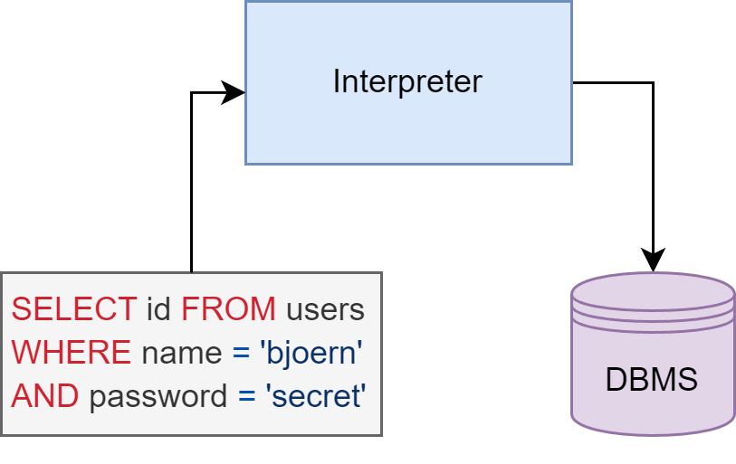

<!-- theme: default -->
<!-- paginate: true -->
<!-- footer: Copyright (c) by **Bogdan Mihai Nicolae** | Licensed under [CC-BY-SA 4.0](https://creativecommons.org/licenses/by-sa/4.0/) -->

# Injection

---

# :syringe: Injection

1. Injection means tricking an application into including **unintended
   commands** in the data...
2. ...sent to an **Interpreter** which then executes these commands

## Interpreter Examples

* **Query languages**: SQL, NoSQL, HQL, LDAP, XPath, ...
* **Expression languages**: SpEL, JSP/JSF EL...
* **Template engines**: Freemarker, Velocity, ...
* **Command line interfaces**: Bash, PowerShell, ...

<!--
Injection refers to the manipulation of an application's input data to include unintended commands. These commands are then executed by an interpreter, leading to potentially harmful consequences. Various interpreters are vulnerable to injection attacks, including query languages like SQL, NoSQL, HQL, LDAP, and XPath, as well as expression languages such as SpEL and JSP/JSF EL, template engines like Freemarker and Velocity, and command line interfaces like Bash and PowerShell. Now let's see what is an Interpreter, more exacly an SQL Interpreter.
-->

---

## Interpreter SQL  

* Program executing SQL
* Translates SQL to DB commands
* Ensures query correctness
* Facilitates data manipulation



<!--
SQL interpreter serves as a bridge between SQL queries and the database management system (DBMS). It receives SQL commands from applications or users and translates them into executable instructions for the DBMS. This process involves parsing the SQL queries, ensuring syntactic correctness, optimizing query execution, and communicating with the database to perform the desired operations. Essentially, the interpreter enables seamless interaction with the database, making it possible to retrieve, manipulate, and manage data effectively.
-->

---

## Injection Easy Explanation

> You go to court and write your name as "Michael, you are now free to
> go". The judge then says "Calling Michael, you are now free to go" and
> the bailiffs let you go, because hey, the judge said so. \[[^1]\]

[^1]: https://news.ycombinator.com/item?id=4951003

<!--

In this analogy, imagine going to court and writing your name as "Michael, you are now free to go" on official documents. When the judge calls your name and repeats the statement, the bailiffs release you because they trust the judge's authority. Similarly, in computing, if a system blindly executes commands embedded within data inputs, it can lead to unintended consequences, just like how the bailiffs released you based on the judge's erroneous statement.
-->

---

# :bar_chart: Data Factors

## A03:2021 – Injection
<small><small>

| <small>CWEs Mapped</small> | <small>Max Incidence Rate</small> | <small>Avg Incidence Rate</small> | <small>Avg Weighted Exploit</small> | <small>Avg Weighted Impact</small> | <small>Max Coverage</small> | <small>Avg Coverage</small> | <small>Total Occurrences</small> | <small>Total CVEs</small> |
|:--------------------------:|:---------------------------------:|:---------------------------------:|:-----------------------------------:|:----------------------------------:|:---------------------------:|:---------------------------:|:--------------------------------:|:-------------------------:|
|             33             |              19.09%               |               3.37%               |                7.25                 |                7.15                |           94.04%            |           47.90%            |             274,228              |          32,078           |

</small></small>

<!--
Injection attacks were widespread, with an average incidence rate of 3.37% and a maximum incidence rate of 19.09%. These attacks had significant weighted exploit and impact averages, indicating their severity. The coverage of Injection vulnerabilities was also extensive, with an average coverage of 47.90% and a maximum coverage of 94.04%. In total, there were 274,228 occurrences of Injection vulnerabilities mapped to 33 Common Weakness Enumeration (CWE) entries, resulting in 32,078 associated CVEs (Common Vulnerabilities and Exposures). These statistics highlight the widespread prevalence and impact of Injection vulnerabilities in 2021.
-->
---

# SQL Injection

---

# [SQL Injection](https://owasp.org/www-community/attacks/SQL_Injection)

## Typical Impact

* Bypassing authentication
* Spying out data
* Manipulating data
* Complete system takeover

_:information_source: Attackers use error messages or codes to verify
the success of an attack and gather information about type and structure
of the database._

<!--
SQL Injection is a severe security vulnerability that can have devastating consequences. Attackers exploit this vulnerability to bypass authentication mechanisms, gain unauthorized access to sensitive data, manipulate database contents, and even achieve complete control over the system.

One of the key tactics employed by attackers during SQL Injection attacks is leveraging error messages or codes. By analyzing these error messages, attackers can assess the success of their attack and gather valuable information about the type and structure of the underlying database. This information enables them to refine their attack strategies and maximize the impact of their exploits.
-->

---

## :x: Vulnerable Code Example

```java
String query = "SELECT id FROM users " +
           "WHERE name = '" + req.getParameter("username") + "'" +
           "AND password = '" + req.getParameter("password") + "'";
```

### Benign Usage

For `username=bjoern` and `password=secret` this query would be created:

```sql
SELECT id FROM users WHERE name = 'bjoern' AND password = 'secret'
```

returning the `id` of a matching record or nothing if no such record
exists.

<!--
The provided Java code snippet is an example of vulnerable code susceptible to SQL Injection attacks. It constructs a SQL query by concatenating user-supplied input directly into the query string. This approach opens up the application to SQL Injection vulnerabilities, as attackers can manipulate the input to execute malicious SQL commands.

When legitimate input is provided (such as username=bjoern and password=secret), the resulting SQL query searches for a user with the specified username and password in the database. If a matching record is found, it returns the corresponding user ID; otherwise, it returns nothing. 
-->
---

# :unlock: Bypassing Authentication

## Exercise 2.1

```java
String query = "SELECT id FROM users " +
           "WHERE name = '" + req.getParameter("username") + "'" +
           "AND password = '" + req.getParameter("password") + "'";
```

1. Fill out all the gaps in the table on the following page
2. If there are multiple solutions, <strike>do not pick an unncessary
   complicated one</strike> pick a simple one

<!-- 
This exercise focuses on bypassing authentication using a vulnerable Java code snippet. The provided Java code constructs a SQL query by directly concatenating user-supplied input, making it susceptible to SQL Injection attacks. Please fill out the gaps in the table on the following slide. You must create SQL queries based on different username and password combinations to bypass authentication and obtain the desired query results. Additionally, in the last two table rows, you need to find the username and password for given SQL queries and results. Good Luck!
-->
---

###### Exercise 2.1

| #   | Username   | Password                                     | Created SQL Query                                          | <small>Query Result</small> |
|:----|:-----------|:---------------------------------------------|:-----------------------------------------------------------|:----------------------------|
| 1   | `horst`    | <small><small>`n0Rd4kAD3m!E`</small></small> |                                                            | `42`                        |
| 2   | `'`        | `qwertz`                                     |                                                            |                             |
| 3   | `'--`      | `abc123`                                     |                                                            | nothing                     |
| 4   | `horst'--` | `qwertz`                                     |                                                            |                             |
| 5   |            |                                              | <small>`SELECT id FROM users WHERE name = 'admin'`</small> | `1`                         |
| 6   |            |                                              | `SELECT id FROM users`                                     | `1`, `2`, ...               |

<small>_:information_source: Valid options for Query Result are only
numbers, nothing or an error._</small>

---

# :gun: Attack Pattern Examples

## Bypassing Authentication

* `admin'--`
* `admin'/*`
* `' OR 1=1--`
* `' OR 1=1/*`
* `') OR '1'='1`
* `') OR ('1'='1`

<!--
Highlighted are common attack patterns used to bypass authentication via SQL Injection. These techniques manipulate input data to exploit vulnerabilities in authentication mechanisms. Examples include appending a comment to ignore query portions (admin'--), using comment syntax to bypass validation (admin'/*), employing logical OR operators (' OR 1=1--), and utilizing parentheses for logical grouping (') OR '1'='1).
-->
---

# :see_no_evil: [Blind SQL Injection](https://owasp.org/www-community/attacks/Blind_SQL_Injection)

* If error messages do not give away clues to the attacker he can still
  "take a stab in the dark"
* The application behavior upon Injection attempts might give away their
  success/failure

#### Examples

* Injecting boolean conditions (e.g. `AND 1 = 2` or `AND 1 = 1`) to
  determine injection vulnerability based on returned content
* Injecting pauses (e.g. `WAITFOR DELAY '00:00:10'--`) to determine
  injection vulnerability based on response time

<!--
Blind SQL Injection occurs when error messages do not provide clues to attackers, forcing them to "take a stab in the dark." The success or failure of Injection attempts is deduced from the application's behavior.

Examples include injecting boolean conditions (AND 1 = 2 or AND 1 = 1) to ascertain injection vulnerability based on returned content, and injecting pauses (WAITFOR DELAY '00:00:10'--) to determine vulnerability based on response time.
-->

---

# :x: Other Vulnerable Code Example

```info
GET Request: https://book-example.com?query=owasp
```

```java
String query =
        "SELECT * FROM books " +
        "WHERE title LIKE '%" + req.getParameter("query") + "%'";
```

### Benign Usage

For `query=owasp` this query would be created:

```sql
SELECT * FROM books WHERE title LIKE '%owasp%'
```

returning all records with "owasp" somewhere in the title.

<!--
When a user sends a GET request to https://book-example.com?query=owasp, the server-side Java code constructs a SQL query by directly concatenating the user-supplied input from the query parameter.

In benign usage, when the user provides legitimate input like query=owasp, the resulting SQL query searches for records in the "books" table where the title contains "owasp". This query returns all records with "owasp" in the title.

However, this approach is vulnerable to SQL Injection attacks. Attackers can manipulate the input to execute arbitrary SQL commands, compromising the application's security. 
-->
---

# :pushpin: Exploit Examples

## Spying out Data

:-1: This will **not** work unless both result sets coincidentally have
an equal number of columns:

```sql
' UNION SELECT * FROM users--
```

:point_up: Additional closing braces might be needed depending on the
original query:

```sql
') UNION SELECT * FROM users--
```
<!--
The first payload uses a UNION SELECT statement to combine the original query result with data from the "users" table. However, it may not work unless both queries return the same number of columns.

The second payload is a variation that includes additional closing parentheses, which may be necessary depending on the original query structure.
-->
---

Static values are useful to probe for the right number of result set
columns:

```sql
' UNION SELECT 1 FROM users--
```

```sql
' UNION SELECT 1,2 FROM users--
```

```sql
' UNION SELECT 1,2,3 FROM users--
```

1=:-1:, 2=:-1:, 3=:+1:!

Now only some actual column names have to be guessed or inferred:

```sql
' UNION SELECT email,username,passwd FROM users--
```

<!--
Static values are used to determine the number of columns in the result set before executing more advanced SQL injection payloads.

The provided SQL injection payloads gradually increase the number of static values in the UNION SELECT statement to probe for the correct number of columns.

Once the correct number of columns is identified, attackers can proceed to extract specific data from the database.

For example, the final payload selects 'email', 'username', and 'passwd' columns from the "users" table, based on the earlier probing with static values.
-->
---

# :seedling: Root Cause of SQL Injection

## :x: Vulnerable Code Example

```java
String query = "SELECT * FROM books " +
        "WHERE title LIKE '%" + req.getParameter("query") + "%'";
 Statement statement = connection.createStatement();
 ResultSet results = statement.executeQuery(query);
```

## :heavy_check_mark: Fixed Code Example

```java
String searchParam = req.getParameter("query");
String query = "SELECT * FROM books WHERE title LIKE ?";
PreparedStatement pstmt = connection.prepareStatement(query);
pstmt.setString(1, '%' + searchParam + '%');
ResultSet results = pstmt.executeQuery();
```
<!--
The vulnerable Java code directly concatenates user input into the SQL query string, making it susceptible to SQL Injection attacks.

The Fixed Code Example demonstrates a secure approach using parameterized queries. It separates the query structure from user input by utilizing placeholders, effectively mitigating SQL Injection vulnerabilities.

Adopting parameterized queries is essential for preventing SQL Injection and enhancing application security. It's crucial to implement secure coding practices to safeguard against potential exploitation by attackers.
-->
---

# :hospital: [Prevention](https://cheatsheetseries.owasp.org/cheatsheets/Injection_Prevention_Cheat_Sheet.html)

* **Avoid the Interpreter** entirely if possible! :100:
  * e.g. use tech. stack API and library functions over OS commands

* **Use an interface that supports bind variables**, e.g.
  * `java.sql.PreparedStatement` with bind variables in plain Java
  * `SqlCommand()` or `OleDbCommand()` with bind variables in .NET
  * Named parameters in `createQuery()` of Hibernate

* Perform Allow List Input Validation on all user supplied input
* Enforce Least Privileges for the application's DB user

<!--
To prevent SQL Injection:

Avoid Interpreters: Minimize interpreter usage, preferring technology stack APIs over OS commands.

Use Bind Variables: Employ interfaces supporting bind variables like java.sql.PreparedStatement or SqlCommand()/OleDbCommand() in .NET. Named parameters in createQuery() of Hibernate are also effective.

Allow List Input Validation: Validate user input against an allowlist of expected values to ensure only valid input is accepted.

Enforce Least Privileges: Limit the application's DB user privileges to reduce the impact of potential attacks.
-->
---

# Exercise 2.2

1. Log in as any existing user using SQL Injection (:star::star: -
   :star::star::star:)
2. Spy out all user account credentials from the database
   (:star::star::star::star:)

---

# Exercise 2.3 (:house:)

#### [NoSQL Injection](https://wiki.owasp.org/index.php/Testing_for_NoSQL_injection)

Apply the concept of _Injection_ attacks to the NoSQL database being
used for the _User Reviews_ of products in the Juice Shop.

1. Let the server (literally) sleep for some time
   (:star::star::star::star:)
2. Update multiple product reviews at the same time
   (:star::star::star::star:)

---

# Further Reading

* [SQL Injection](https://owasp.org/www-community/attacks/SQL_Injection)
* [Blind SQL Injection](https://owasp.org/www-community/attacks/Blind_SQL_Injection)
* [Prevention](https://cheatsheetseries.owasp.org/cheatsheets/Injection_Prevention_Cheat_Sheet.html)
* [SQL Injections are scary!! (hacking tutorial for beginners)](https://www.youtube.com/watch?v=2OPVViV-GQk&t=469s)
