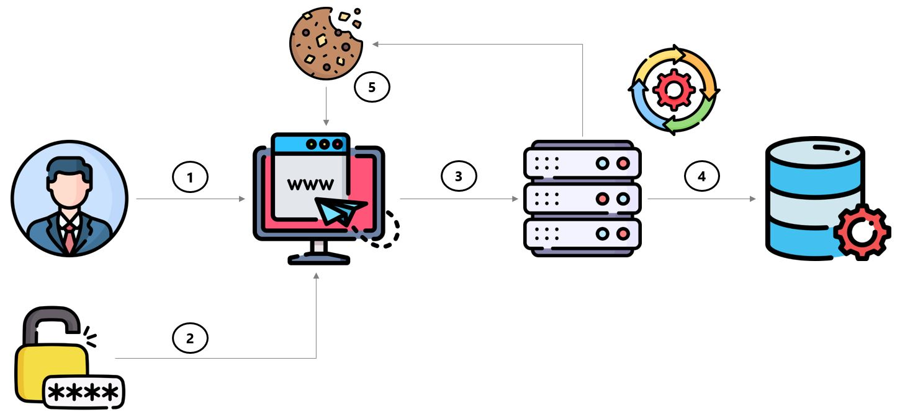
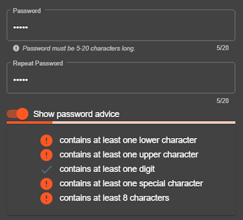
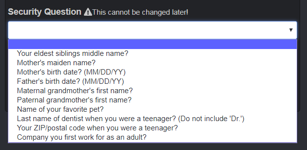

<!-- theme: default -->
<!-- paginate: true -->
<!-- footer: Copyright (c) by **Bogdan Mihai Nicolae** | Licensed under [CC-BY-SA 4.0](https://creativecommons.org/licenses/by-sa/4.0/) -->

# Authentication Flaws

---
# :closed_lock_with_key: [Authentication](https://en.wikipedia.org/wiki/Authentication)

* :question: Who are you
* :mag: Verify the user's identity
* :key: Authentication works throught password, one time pins, biometric information
* :leftwards_arrow_with_hook: Usually done before authorization

<!--
Before we delve into the typical flaws in authentication, let's first understand what authentication is.

Authentication essentially answers the question, "Who are you?" It's the process of confirming an individual's identity before granting access to a system or service.

The primary goal of authentication is to verify the user's identity accurately. This helps ensure that only authorized individuals gain access to sensitive information or resources.

Authentication works through various methods, including passwords, one-time pins (OTPs), biometric information (such as fingerprints or facial recognition), and more.

It's essential to note that authentication typically occurs before authorization. In other words, users must prove their identity before they're allowed to perform specific actions or access certain resources within a system.
-->
---

# :globe_with_meridians: Website authentication - Server Session

<!-- _footer: Icons are form flaticon.com -->

<!--
Here's an example of an authentication flow:

1. A user visits a website.
2. The user logs in using a password.
3. The user's credentials (username and password) are sent to the server for validation.
4. The server verifies the user's credentials and creates a session.
5. The session information, usually in the form of a session ID, is sent back to the user's browser. The browser caches the session information using a cookie to facilitate future interactions with the website.
-->
---

# :x: [Typical Flaws in Authentication](https://owasp.org/Top10/A07_2021-Identification_and_Authentication_Failures/)

* Permits brute force or other automated attacks
* Permits default, weak, or well-known passwords
* Uses weak or ineffective credential recovery and forgot-password
  processes (e.g. "knowledge-based answers")
* Uses plain text, encrypted, or weakly hashed passwords
* Has missing or ineffective multi-factor authentication
* Exposes Session IDs in the URL
* Does not rotate Session IDs after successful login
* Does not properly invalidate Session IDs

<!--
Authentication flaws can lead to serious security vulnerabilities in your system. Here are some common issues to watch out for:

Allowing brute force or automated attacks to guess passwords, which can compromise user accounts.

Using default, weak, or widely-known passwords, making it easy for attackers to gain unauthorized access.

Implementing weak or ineffective processes for credential recovery and forgot-password functionalities, such as relying on easily guessable answers to security questions.

Storing passwords in plain text, encrypted form, or using weak hashing algorithms, which can lead to unauthorized access if the password database is compromised.

Failing to implement multi-factor authentication, leaving accounts vulnerable to compromise if passwords are stolen.

Exposing Session IDs in URLs, which can make them susceptible to session hijacking attacks.
Neglecting to rotate Session IDs after successful login, increasing the risk of session fixation attacks.

Failing to properly invalidate Session IDs after logout, allowing attackers to potentially reuse old sessions to gain unauthorized access.
-->
---

# :bar_chart: Data Factors

## A07:2021 – Identification and Authentication Failures

<small><small>

| <small>CWEs Mapped</small> | <small>Max Incidence Rate</small> | <small>Avg Incidence Rate</small> | <small>Avg Weighted Exploit</small> | <small>Avg Weighted Impact</small> | <small>Max Coverage</small> | <small>Avg Coverage</small> | <small>Total Occurrences</small> | <small>Total CVEs</small> |
|:--------------------------:|:---------------------------------:|:---------------------------------:|:-----------------------------------:|:----------------------------------:|:---------------------------:|:---------------------------:|:--------------------------------:|:-------------------------:|
|             22             |              14.84%               |               2.55%               |                7.40                 |                6.50                |           79.51%            |           45.72%            |             132,195              |           3,897           |

</small></small>

---

# Exercise 4.1 (:pushpin:)

1. Watch
   [How To Keep Your Passwords Safe](https://www.facebook.com/CollegeHumor/videos/10155483807197807/)
   :tv:
2. Log in with MC SafeSearch's user account (:star::star:)

_:warning: Do **not** use SQL Injection for authentication bypass!_

<!--
In our first exercise we'll explore password safety and authentication practices.

We will begin by watching the video titled "How To Keep Your Passwords Safe" via the provided link. 

Following the video, we'll engage in a practical exercise. Please log in using MC SafeSearch's user account. Do not use SQL Injection for authentication bypass!
-->
---

# Exercise 4.2 (:pushpin:)

1. What benefits and downsides (if any) would enforcing user passwords
   with the advice below have?
2. What password might the user currently have typed in?

<!--
In the second exercise, we'll analyze the benefits and potential drawbacks of enforcing user passwords based on the advice below:

What are the benefits of enforcing these password requirements?
What downsides, if any, might arise from implementing these requirements?
What password might the user currently have typed in?
-->
---

# Exercise 4.3 (:pushpin:)

1. Pick one Security Question and explain how :muscle: it is against
   attacks.
2. What would you recommend to pick as an answer? Assume that the risk
   of compromise is full takeover of your user account.

<!--
In this exercise, we're focusing on security questions and their effectiveness against attacks. Here's what to consider:

Choose one security question and assess its resilience against attacks. Consider factors such as how difficult it is for attackers to guess or obtain the answer through public information or social engineering.

Think about what type of answer you would recommend for the selected security question, especially considering the worst-case scenario where the compromise of the answer could result in the complete takeover of your user account.
-->

---

# :hospital: [Prevention](https://cheatsheetseries.owasp.org/cheatsheets/Authentication_Cheat_Sheet.html)

#### :passport_control: [Password Strength Controls](https://pages.nist.gov/800-63-3/sp800-63-3.html)

* **Enforce minimum password length** of at least 10 characters
* Maximum length should allow 64 characters or more
* **No periodic password resets** as users rely on predictable patterns
* Avoid password complexity rules as _all of them_ are predictable
* Ban bad passwords or ones which have appeared in data breaches
  * e.g. [Troy Hunt's 10GB+ list](https://haveibeenpwned.com/Passwords)
    or
    [Daniel Miesler's various lists](https://github.com/danielmiessler/SecLists/tree/master/Passwords)
* Allow convenience features on password fields
  * Offer _Show Password while typing_ option
  * Allow pasting from clipboard into password fields

<!--
When it comes to password management, consider implementing the following measures:

Enforce a minimum password length of at least 10 characters to enhance security.

Allow for a maximum password length of 64 characters or more to accommodate complex and unique passwords.

Avoid enforcing periodic password resets, as users tend to rely on predictable patterns, which may weaken security over time.

Instead of imposing rigid complexity rules, which can be predictable and burdensome for users, consider alternative methods to enhance password security.

Implement a blacklist of banned passwords, including those known to have appeared in data breaches. Resources like Troy Hunt's extensive list or Daniel Miesler's collections can be valuable references.

Incorporate convenience features in password fields to improve user experience, such as offering the option to display the password while typing or allowing users to paste passwords from the clipboard.
-->
---

#### :incoming_envelope: [Secure "Forgot Password" Mechanism](https://cheatsheetseries.owasp.org/cheatsheets/Forgot_Password_Cheat_Sheet.html)

* Return a consistent message for both existent and non-existent
  accounts
* Ensure that the time taken for the user response message is uniform
* Use a side-channel to communicate the method to reset their password
* Use URL tokens for the simplest and fastest implementation
* Ensure that generated tokens or codes are:
  * Randomly generated using a cryptographically safe algorithm
  * Sufficiently long to protect against brute-force attacks
  * Stored securely
  * Single use and expire after an appropriate period

<!--
To enhance the security of the "Forgot Password" feature, consider implementing the following best practices:

Provide a consistent message for both existent and non-existent accounts to avoid leaking information about account existence.

Ensure that the time taken to display the response message to users is consistent, regardless of whether the account exists or not, to prevent attackers from exploiting timing discrepancies.

Utilize a side-channel communication method, such as email or SMS, to securely communicate the password reset process to users, reducing the risk of interception.

Employ URL tokens for password reset, as they offer a simple and efficient implementation method.

Ensure that the generated tokens or codes are:
  Randomly generated using a cryptographically secure algorithm to prevent predictability.
  Sufficiently long to withstand brute-force attacks.
  Stored securely to prevent unauthorized access.
  Single-use and set to expire after an appropriate period to mitigate the risk of replay attacks.
-->
---

#### :lock: [Secure Password Storage](https://cheatsheetseries.owasp.org/cheatsheets/Password_Storage_Cheat_Sheet.html)

* Use
  [Argon2id](https://cheatsheetseries.owasp.org/cheatsheets/Password_Storage_Cheat_Sheet.html#argon2id)
  unless you have a good reason not to
* Set a reasonable
  [work factor](https://cheatsheetseries.owasp.org/cheatsheets/Password_Storage_Cheat_Sheet.html#work-factors)
  for your system
* Use a
  [salt](https://cheatsheetseries.owasp.org/cheatsheets/Password_Storage_Cheat_Sheet.html#salting)
  (modern algorithms like Argon2id, bcrypt and PBKDF2 do this for you automatically)
* Consider using a
  [pepper](https://cheatsheetseries.owasp.org/cheatsheets/Password_Storage_Cheat_Sheet.html#peppering)
  to provide an additional layer of security

<!--
To ensure the confidentiality and integrity of stored passwords, follow these best practices:

Utilize the Argon2id hashing algorithm, unless there is a compelling reason to use an alternative. Argon2id is a state-of-the-art password hashing function designed to resist various password cracking techniques.

Set a reasonable work factor for your system when using password hashing algorithms. The work factor determines the computational cost of hashing passwords and should be chosen to balance security and performance.

Always use a salt when hashing passwords. Modern algorithms like Argon2id, bcrypt, and PBKDF2 automatically incorporate salt into the hashing process, enhancing security by preventing identical passwords from producing the same hash value.

Consider implementing a pepper, which is an additional secret added to the password hashing process. Peppers provide an extra layer of security by adding complexity and increasing the difficulty of password cracking attempts.
-->
---

#### :customs: Other Authentication Controls

* **Transmit passwords only over TLS**
  * The "login landing page" must be served over TLS as well
* **Prevent Brute-Force Attacks** (e.g. throttling or periodic lockout)
* Require re-authentication for sensitive features
* **Offer optional 2FA / MFA**
  * Consider strong transaction authentication

#### Enterprise Controls

* Use centralized corporate authentication system (if in place) :100:

<!--
Here are some additional authentication controls to strengthen security:

Transmit passwords only over TLS to prevent interception.

Prevent brute-force attacks through throttling or lockout mechanisms.

Require re-authentication for sensitive features.

Offer optional 2FA/MFA for added security, including strong transaction authentication.

At the enterprise level:
Use a centralized corporate authentication system for streamlined user management and consistent security policies.
-->

---

# :calling: Two-Factor Authentication

> Two-factor authentication adds a second level of authentication to an
> account log-in. When you have to enter only your username and one
> password, that's considered a single-factor authentication. 2FA
> requires the user to have two out of three types of credentials before
> being able to access an account. The three types are:
>
> * **Something you know**, such as a personal identification number
>   (PIN), password or a pattern
> * **Something you have**, such as an ATM card, phone, or fob
> * **Something you are**, such as a biometric like a fingerprint or
>   voice print \[[^1]\]

[^1]: https://www.cnet.com/news/two-factor-authentication-what-you-need-to-know-faq/

<!--
Let's delve into Two-Factor Authentication (2FA), a crucial security measure that adds an extra layer of protection to account log-ins.

Traditionally, account log-ins involve entering a username and password, which is considered single-factor authentication. 2FA requires users to provide two out of three types of credentials before accessing an account:

Something you know: This could be a personal identification number (PIN), password, or pattern - information that only the user should know.

Something you have: This refers to physical items like an ATM card, phone, or fob, which the user possesses and can use to authenticate their identity.

Something you are: This involves biometric data such as fingerprints or voice prints, which uniquely identify individuals based on physical characteristics.
-->

---

# [2FA Method Comparison](https://www.expressvpn.com/blog/best-two-factor-authentication)

| Method            | Security        | Privacy                              | Access             | Prevalence                                             |
|:------------------|:----------------|:-------------------------------------|:-------------------|:-------------------------------------------------------|
| SMS               | :key:           | :sunglasses:                         | :door::door::door: | :department_store::department_store::department_store: |
| Authenticator App | :key::key:      | :sunglasses::sunglasses::sunglasses: | :door:             | :department_store::department_store:                   |
| Hardware Key      | :key::key::key: | :sunglasses::sunglasses::sunglasses: | :door::door:       | :department_store:                                     |

> <small>Hardware keys win from a security perspective, they are private
> and unaffected by a dying or out of range phone. However, only a few
> services (Google, Dropbox, Facebook, Github and a few others) support
> the standard so far. Unless you trust your phone provider (and few
> providers are trustworthy), **an authenticator app is the best
> option**.</small>

<!--
Let's compare different methods of Two-Factor Authentication (2FA) to understand their security, privacy, access, and prevalence.

SMS: While widely used, SMS-based 2FA has moderate security and privacy. It's convenient but may be susceptible to interception or SIM swapping attacks.

Authenticator App: This method offers high security and privacy levels. Authenticator apps generate time-based or event-based codes on the user's device, enhancing security without compromising privacy.

Hardware Key: Considered the most secure option, hardware keys provide excellent security and privacy. They are immune to phishing attacks and don't rely on the user's phone or network connectivity. However, their adoption is still limited to a few services.

Overall, hardware keys offer the highest security, but authenticator apps are the most practical option for widespread use. Choose the method that best suits your security needs and preferences.
-->

---

# :lock_with_ink_pen: Password Managers

> Password managers are programs, browser plugins or web services that
> automate management of large number of different credentials.

|  |  |  |
|:------------------------------------------------------------------------------------------------|:--------------------------------------------------------------------------------------------------------|:---------------------------------------------------------------------------------------------------------------|
| Open Source (GPLv2)                                                                             | Proprietary / Freemium                                                                                  | Proprietary                                                                                                    |
| Local installation, optional file or cloud sync                                                 | Cloud-based                                                                                             | Local installation with Cloud sync                                                                             |

<!--
Password managers are indispensable tools for efficiently managing numerous credentials. They come in various forms, including programs, browser plugins, or web services, automating tasks like storage and autofill.

Popular options include:

KeePass: Open-source, offering local installation with optional cloud sync.
LastPass: Freemium, cloud-based, and user-friendly.
1Password: Known for ease of use, offering local installation with cloud sync.
Choose a password manager that suits your needs and enhances your security practices.
-->
---

# :globe_with_meridians: More web

> Web applications should at least not make password managers job more
> difficult than necessary by observing the following recommendations:
> * use standard HTML forms for username and password input with
>   appropriate `type` attributes,
> * do not artificially limit user passwords to a length "reasonable for
>   humans" and allow passwords lengths up to 128 characters,
> * do not artificially prevent copy and paste on username and password
>   fields,
> * avoid plugin-based login pages (Flash, Silverlight etc) \[[^1]\]

[^2]: https://cheatsheetseries.owasp.org/cheatsheets/Authentication_Cheat_Sheet.html#password-managers

<!--
As we conclude, it's crucial for web applications to facilitate the seamless integration of password managers. By following these recommendations, we can ensure a smoother experience for users:

Utilize standard HTML forms for username and password input, including appropriate type attributes, to enhance compatibility with password managers.

Avoid imposing artificial limitations on password length and allow for passwords up to 128 characters to accommodate strong, unique passwords.

Enable copy and paste functionality on username and password fields to facilitate password manager usage.

Steer clear of plugin-based login pages, such as those relying on Flash or Silverlight, to maintain compatibility and security.
-->
---

# Exercise 4.4 (:house:)

1. Log in with the admin's user account (:star::star:)
2. Reset Jim's password by answering his secret question
   (:star::star::star:)
3. Log in with Bjoern's Google account (:star::star::star::star:)

_:warning: Do **not** use SQL Injection for authentication bypass! Also,
do **not** hack Bjoern's actual Google account!_

---

# Exercise 4.5 (_optional_)

1. Install a 2FA app on your phone (e.g.
   [Google Authenticator](https://play.google.com/store/apps/details?id=com.google.android.apps.authenticator)
   or [Authy](https://authy.com/))
2. Visit <https://2fa.directory/> and find out what services you use
   offer 2FA
3. Turn 2FA on wherever possible
4. Do not forget to print (=:printer:!) the backup codes and keep them
   safe

:bulb: _Pro tip: Print hard copies of the originally displayed QR codes
for easy setup on any new phone! Just store them very securely!_
