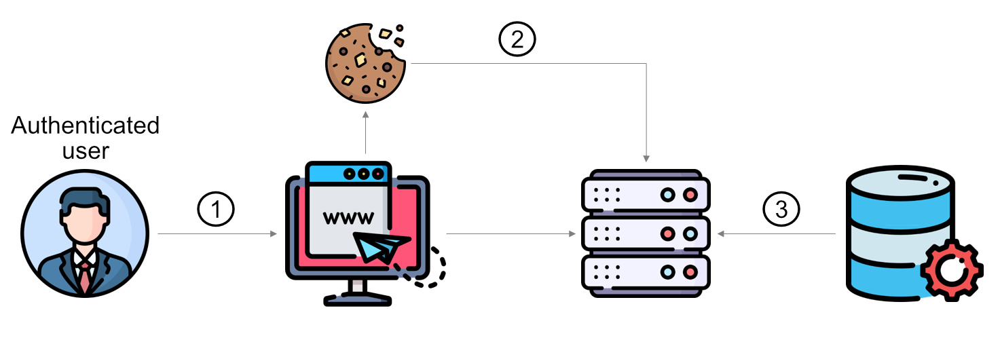

<!-- theme: default -->
<!-- paginate: true -->
<!-- footer: Copyright (c) by **Bogdan Mihai Nicolae** | Licensed under [CC-BY-SA 4.0](https://creativecommons.org/licenses/by-sa/4.0/) -->

# Authorization Flaws

---
# :closed_lock_with_key: [Authorization](https://en.wikipedia.org/wiki/Authorization)

* :question: What are you allowed to do
* :mag: Determine user permissions
* :key: Authorization works throught settings that are implemented and maintained by the organization
* :leftwards_arrow_with_hook: Authorization always take palce after authorization

<!--
Before diving into common flaws with authorization systems, let's first ensure we understand the basics of what authorization actually is.

Authorization essentially answers the question, “What are you allowed to do?” It is the process of determining what specific actions or resources a user has permission to access after they have been authenticated.

The primary goal of authorization is to ensure that users can only perform the actions and access the resources that they are permitted to, based on their role or other criteria defined by the organization.

Authorization works through settings that are implemented and maintained by the organization. These settings define user permissions and access levels, which could include reading or writing files, accessing certain services, or modifying system configurations.

It's important to note that authorization typically occurs after authentication. In other words, once a user’s identity is confirmed, the system then decides what that user is allowed to do within the system.

-->
---

# :globe_with_meridians: Website Authorization flaw - Server Session

<!-- _footer: Icons are form flaticon.com -->

<!--
Here's an example of an authorization flow:

1. An authenticated user attempts to access a resource on a website, which could be a page, file, video, or similar content.
2. If the website uses session-based authentication, the browser sends a cookie containing the user's information to the server.
3. The server then checks the user's permissions for the requested resource. If the user has the appropriate access rights, they are granted access to the resource. If not, they are redirected to an error page.

Now that we have a clear understanding of how authorization works, let’s explore the concept of broken access control.
-->

---

# :lock_with_ink_pen: [Broken Access Control](https://owasp.org/Top10/A01_2021-Broken_Access_Control/)

Access control is supposed to prevent that users can act outside of
their intended permissions.

##### Possible Impact of Broken Access Control

* Access unauthorized functionality and/or data, such as access other
  users' accounts
* View sensitive files
* Modify other users' data
* Change access rights

<!-- 
 When we talk about access control, we mean the mechanisms in place to ensure users can only perform actions or access resources that align with their assigned permissions.

However, when these controls are broken or improperly implemented, users may be able to bypass them. The result? They can act outside of their intended permissions, which can lead to serious consequences.

For example, broken access control could allow a user to:

Access unauthorized functionality or data, such as viewing other users' accounts.
They might gain access to sensitive files that should be restricted.
Worse yet, they could modify data belonging to other users.
In some cases, they might even escalate their privileges, allowing them to change access rights altogether.

These kinds of vulnerabilities can have a huge impact, exposing companies to data breaches and reputational damage. Throughout the presentation, we'll dive deeper into how these flaws arise and, more importantly, how we can protect against them.
-->

---

##### :hocho: Common Attacks

* Modifying URL, internal application state, or HTML page
* Changing the primary key to another users record
* Elevation of privilege
  * Acting as a user without being logged in
  * Acting as an admin when logged in as a user

_:information_source: Obtaining a higher level of access is also
referred to as **Vertical** Privilege Escalation while same-level access
to another user's data is called **Horizontal** Privilege Escalation._

<!--
"Now let’s talk about some common attacks related to Broken Access Control. Attackers can:

- Modify the URL, the internal state of the application, or HTML to access unauthorized content.
- Change the primary key in a request to view another user’s data.
P- erform Privilege Escalation attacks. For example, they can act as a user without logging in, or elevate themselves to an admin role when logged in as a regular user.

There are two types of privilege escalation:
Vertical Privilege Escalation, where users gain higher access, like becoming an admin.
Horizontal Privilege Escalation, where users access another person’s data while remaining at the same access level."
-->

---

* Metadata manipulation
  * Replaying or tampering with access control tokens
  * Cookie or hidden field manipulation
* Force browsing to authenticated pages as an anonymous user or to
  privileged pages as a standard user
* Accessing API with missing access controls for `POST`, `PUT` and
  `DELETE`

<!--
Another common attack method is metadata manipulation. This involves:

- Replaying or tampering with access control tokens.
- Manipulating cookies or hidden fields to bypass access controls.
- Force browsing is another tactic, where an attacker directly accesses authenticated or privileged pages by guessing URLs. Attackers can also exploit APIs that lack proper security for HTTP methods like POST, PUT, and DELETE.
-->
---

# :bar_chart: Data Factors

## A01:2021 – Broken Access Control

<small><small>

| <small>CWEs Mapped</small> | <small>Max Incidence Rate</small> | <small>Avg Incidence Rate</small> | <small>Avg Weighted Exploit</small> | <small>Avg Weighted Impact</small> | <small>Max Coverage</small> | <small>Avg Coverage</small> | <small>Total Occurrences</small> | <small>Total CVEs</small> |
|:--------------------------:|:---------------------------------:|:---------------------------------:|:-----------------------------------:|:----------------------------------:|:---------------------------:|:---------------------------:|:--------------------------------:|:-------------------------:|
|             34             |              55.97%               |               3.81%               |                6.92                 |                5.93                |           94.55%            |           47.72%            |             318,487              |          19,013           |

</small></small>

<!--
Let’s look at some data related to Broken Access Control from the OWASP Top 10. We see that:

34 CWEs are linked to this vulnerability.
The highest occurrence rate is nearly 56%, with an average rate of about 4%.
The potential impact is high, with exploitability and impact scores both around 6.
This shows that Broken Access Control is not only common but also highly dangerous.
-->
---

# Exercise 5.1 (:pushpin:)

Assuming no access control is in place, which privilege escalations are
possible by tampering with the following URLs?

1. `http://logistics-worldwi.de/showShipment?id=40643108`
2. `http://my-universi.ty/api/students/6503/exams/view`
3. `http://document-warehou.se/landingpage?content=index.html`

<!--
For our first exercise, let’s assume there is no access control in place. Given the following URLs, what types of privilege escalations can occur? How might a user manipulate these URLs to access unauthorized data?
-->
---

# Exercise 5.2 (:pushpin:)

1. Log in with the administrator’s user account (:star::star:)
2. Access the administration section of the store (:star::star:)
3. Get rid of all 5-star customer feedback (:star::star:)
4. View another user's shopping basket (:star::star:)
5. Post some feedback for another user but without previously logging in
   as that user (:star::star::star:)

<!--
In this next exercise, consider how you could exploit weak access controls to:

Access the admin section of a store.
View another user's shopping basket.
Delete all 5-star customer feedback.
Post feedback as another user without being logged in as that user.
These scenarios will help us understand how attackers think when targeting broken access controls.
-->

---

# :hospital: [Prevention](https://owasp.org/www-project-top-ten/OWASP_Top_Ten_2017/Top_10-2017_A5-Broken_Access_Control)

* **Access control** is only effective if **enforced in trusted
  server-side code**
* With the exception of public resources, **deny by default**
* **Implement** access control mechanisms **once and re-use** them
  throughout the application
* **Enforce record ownership**
* **Disable web server directory listing** and ensure file metadata and
  backup files are not present within web roots

<!--
Now, how do we prevent these issues? Access control only works if it’s enforced on the server side. Relying on client-side controls is risky because they can be easily bypassed.

Key prevention measures include:

Denying access by default unless specifically permitted.
Implementing access controls once and reusing them throughout the app.
Enforcing record ownership to make sure users can only modify their own data.
Disabling directory listings and ensuring sensitive files are not accessible.
-->

---

# :hospital: More [Prevention](https://owasp.org/www-project-top-ten/OWASP_Top_Ten_2017/Top_10-2017_A5-Broken_Access_Control)

* **Log access control failures**, alert admins when appropriate
* Rate limit API and controller access to minimize the harm from
  automated attack tooling
* Access tokens should be invalidated on the server after logout
* Developers and QA staff should include functional access control unit
  and integration tests

<!--
Here are more strategies to prevent access control failures:

Log access control failures and alert admins as needed.
Rate-limit API access to reduce the damage from automated attacks.
Ensure access tokens are invalidated on the server after logout.
Include access control tests in both development and QA processes to catch vulnerabilities early.
-->
---

## :clipboard: [Access Control Design Principles](https://wiki.owasp.org/images/b/bc/OWASP_Top_10_Proactive_Controls_V3.pdf)

1. Design Access Control thoroughly up front
2. Force all Requests to go through Access Control checks
3. Deny by Default
4. Principle of Least Privilege
5. Don't hardcode roles
6. Log all Access Control events

<!--
When designing access controls, keep these principles in mind:

1. Plan access control thoroughly from the start.
2. Ensure all requests go through access control checks.
3. Deny by default unless a user is explicitly granted access.
4. Follow the Principle of Least Privilege, only giving users the minimum access they need.
5. Avoid hardcoding roles.
6. Log all access control events for monitoring and debugging.
-->

---

# Exercise 5.3 (:house:)

1. Place an order with a negative total (:star::star::star:
2. Order the :christmas_tree: offer that was only available in 2014
      (:star::star::star::star:)
3. Access one or more misplaced files (:star::star::star::star: -
   :star::star::star::star::star::star:)

<!--
Our final exercise are as homework will test your understanding of broken access control. How might you:

Place an order with a negative total?
Order a special offer that was only available in 2014?
Access misplaced files that weren’t meant to be public?
These exercises show the types of attacks possible when access controls are not properly implemented.
-->

---

# SSRF

## Server-Side Request Forgery

---

# :arrow_right: Server-Side Request Forgery

> SSRF flaws occur whenever a web application is fetching a remote resource without validating the user-supplied URL. It allows an attacker to coerce the application to send a crafted request to an unexpected destination, even when protected by a firewall, VPN, or another type of network access control list (ACL).
>
> As modern web applications provide end-users with convenient features, fetching a URL becomes a common scenario. As a result, the incidence of SSRF is increasing. Also, the severity of SSRF is becoming higher due to cloud services and the complexity of architectures. \[[^1]\]

[^1]: https://owasp.org/Top10/A10_2021-Server-Side_Request_Forgery_%28SSRF%29/#description

<!--
Now, let's move on to Server-Side Request Forgery, or SSRF. This vulnerability occurs when a web application fetches a remote resource using a URL provided by the user but fails to properly validate it. In simple terms, an attacker can manipulate the URL to make the server send a crafted request to an unintended destination.

The dangerous part is that this can happen even if the server is protected by firewalls, VPNs, or network access control lists. As modern applications frequently fetch external resources, the risk of SSRF has grown, especially with the rise of cloud services and more complex architectures.
-->
---

# :hocho: Attack Vector Examples

> * Image on an external server (e.g. user enters image URL of their avatar for the application to download and use).
> * Custom WebHook (users have to specify Webhook handlers or Callback URLs).
> * Internal requests to interact with another service to serve a specific functionality. Most of the times, user data is sent along to be processed, and if poorly handled, can perform specific injection attacks. \[[^2]\]

[^2]: https://cheatsheetseries.owasp.org/cheatsheets/Server_Side_Request_Forgery_Prevention_Cheat_Sheet.html#context

<!--
Here are some common examples of SSRF attack vectors:

- Imagine an application where a user provides the URL for their avatar image, and the application downloads it. If the URL isn’t validated, an attacker could trick the server into downloading something malicious.
- Another example is a custom webhook. A user might specify a webhook handler or callback URL, and if that’s not properly handled, it could be used for an SSRF attack.
- Sometimes, an application sends internal requests to other services for certain functionality. If user input is sent along with these requests and isn’t sanitized, an attacker could inject malicious data.

These examples show how easily SSRF can sneak into an application if proper precautions aren’t taken.
-->
---

# SSRF Common Flow

<!-- _footer: ©Copyright 2021 - CheatSheets Series Team, used under CC-BY 3.0 -->

<!--
In this diagram, we can see the common flow of an SSRF attack. Typically, an attacker sends a specially crafted URL through the application. If the application doesn’t validate the URL correctly, the server then makes the request to the target, potentially giving the attacker access to internal systems.
-->

---

# :bar_chart: Data Factors

## A10:2021 – Server-Side Request Forgery (SSRF)

<small><small>

| <small>CWEs Mapped</small> | <small>Max Incidence Rate</small> | <small>Avg Incidence Rate</small> | <small>Avg Weighted Exploit</small> | <small>Avg Weighted Impact</small> | <small>Max Coverage</small> | <small>Avg Coverage</small> | <small>Total Occurrences</small> | <small>Total CVEs</small> |
|:--------------------------:|:---------------------------------:|:---------------------------------:|:-----------------------------------:|:----------------------------------:|:---------------------------:|:---------------------------:|:--------------------------------:|:-------------------------:|
|             1              |               2.72%               |               2.72%               |                8.28                 |                6.72                |           67.72%            |           67.72%            |              9,503               |            385            |

</small></small>

<!--
Now, let’s look at the data for Server-Side Request Forgery based on the OWASP Top 10:

Only one CWE is mapped to SSRF.
The highest and average incidence rates are both around 2.72%.
However, despite the relatively low occurrence rate, SSRF has a high average weighted exploitability score of 8.28 and an impact score of 6.72.
This shows that while SSRF may not be as common as other vulnerabilities, its potential for harm is much greater.
-->

---

# :hospital: [Prevention](https://owasp.org/Top10/A10_2021-Server-Side_Request_Forgery_%28SSRF%29/#how-to-prevent)

## :signal_strength: Network Level

- Segmenting remote resource access functionality in separate networks
- **Enforcing “deny by default”** firewall policies or network access
    control rules to block all but essential intranet traffic
  - Establishing ownership/lifecycle for firewall rules based on applications
  - Logging all accepted *and* blocked network flows on firewalls
    (see [Security Logging and Monitoring Failures](02-09-sdlc.md#security-logging-and-monitoring-failures))

<!--
To prevent SSRF attacks at the network level, we can:

Segment remote resource access functions into separate networks to limit exposure.
Enforce ‘deny by default’ firewall policies, only allowing essential traffic to pass through.
Make sure to establish proper ownership for firewall rules and log both accepted and blocked network traffic. This aligns with broader security principles around logging and monitoring.
-->
---

## :vibration_mode: Application Level

-   **Sanitizing and validating all client-supplied input data**
-   Enforcing the URL schema, port, and destination with a positive allow list
-   Not sending raw responses to clients
-   Disabling HTTP redirections
-   Awareness of URL consistency to avoid attacks such as DNS
    rebinding and “time of check, time of use” (TOCTOU) race conditions

<!--
At the application level, prevention measures include:

Sanitizing and validating all input from the client.
Restricting URLs, ports, and destinations to a positive allow list.
Avoiding sending raw responses back to the client to prevent further exploitation.
Disabling HTTP redirection and ensuring URL consistency to avoid advanced attacks like DNS rebinding or time-of-check, time-of-use (TOCTOU) race conditions.
-->
---

# Exercise 5.4 (_optional_ :house:)

1. Reverse engineer a [juicy malware](https://github.com/juice-shop/juicy-malware) and use what you learn from it...
2. ...to request a hidden resource on server through server (:star::star::star::star::star::star:)

_:information_source: For this to count as an SSRF attack you need to make the Juice Shop server attacks itself._  

<!--
Finally, in this exercise, you'll have the chance to experiment with SSRF by reversing a juicy malware and using it to request a hidden resource on the server. To count as an SSRF attack, your goal is to trick the Juice Shop server into attacking itself.
-->